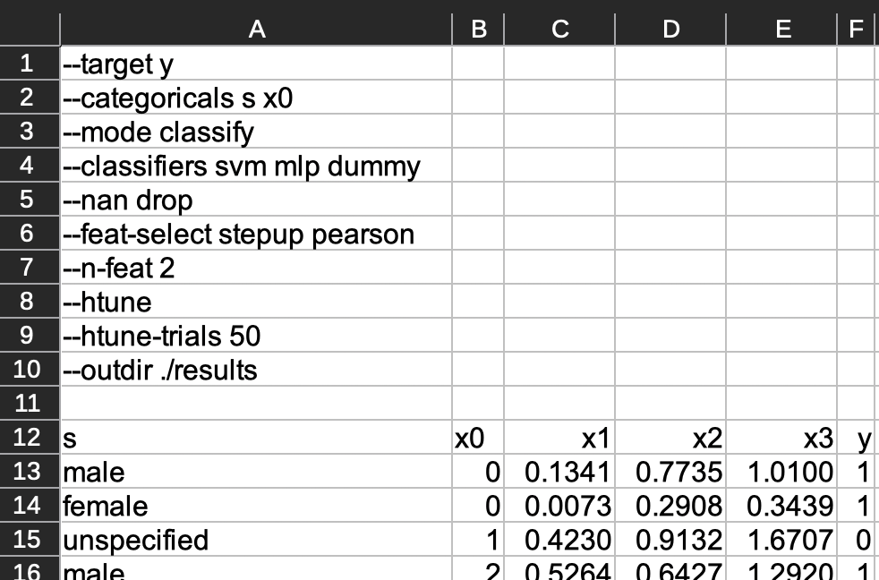
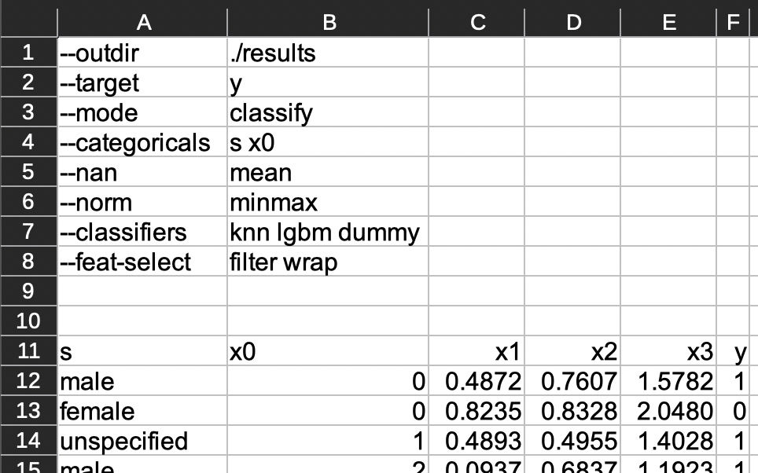

[](https://zenodo.org/badge/latestdoi/364694785)

<!-- omit from toc -->
# Contents

- [Overview](#overview)
  - [For Students or Novices to Machine and Deep Learning](#for-students-or-novices-to-machine-and-deep-learning)
- [Installation](#installation)
  - [Local Install by Shell Script](#local-install-by-shell-script)
  - [By Singularity / Apptainer Container](#by-singularity--apptainer-container)
  - [Windows Support](#windows-support)
- [Usage](#usage)
  - [Quick Start and Examples](#quick-start-and-examples)
    - [Using Builtin Data](#using-builtin-data)
    - [Using a `df-analyze`-formatted Spreadsheet](#using-a-df-analyze-formatted-spreadsheet)
      - [Overriding Spreadsheet Options](#overriding-spreadsheet-options)
  - [Embedding Functionality](#embedding-functionality)
    - [Quickstart](#quickstart)
    - [About the Embedding Models](#about-the-embedding-models)
    - [Supported Dataset Formats](#supported-dataset-formats)
      - [Image Data](#image-data)
      - [Text Data](#text-data)
  - [Usage on Compute Canada / Digital Research Alliance of Canada / Slurm HPC Clusters](#usage-on-compute-canada--digital-research-alliance-of-canada--slurm-hpc-clusters)
    - [Building the Singularity Container](#building-the-singularity-container)
    - [Using the Singularity Container](#using-the-singularity-container)
- [Analysis Pipeline](#analysis-pipeline)
    - [Feature Type and Cardinality Inference](#feature-type-and-cardinality-inference)
    - [Data Preparation](#data-preparation)
      - [Categorical Deflation](#categorical-deflation)
        - [Categorical Target Deflation](#categorical-target-deflation)
    - [Data Splitting](#data-splitting)
    - [Univariate Feature Analyses](#univariate-feature-analyses)
    - [Feature Selection](#feature-selection)
      - [Redundancy-Aware Feature Selection \*\*\[NEW\]\*\*](#redundancy-aware-feature-selection-new)
    - [Hyperparameter Tuning](#hyperparameter-tuning)
    - [Final Validation](#final-validation)
- [Program Outputs](#program-outputs)
  - [Order of Reading](#order-of-reading)
  - [Subdirectories](#subdirectories)
    - [📂 Hashed Subdirectories](#-hashed-subdirectories)
    - [`📂 inspection`](#-inspection)
      - [Destructive Data Changes](#destructive-data-changes)
    - [`📂 prepared`](#-prepared)
    - [`📂 features`](#-features)
      - [`📂 associations`](#-associations)
      - [`📂 predictions`](#-predictions)
    - [`📂 selection`](#-selection)
      - [`📂 embed`](#-embed)
      - [`📂 filter`](#-filter)
      - [`📂 wrap`](#-wrap)
    - [`📂 tuning`](#-tuning)
    - [`📂 results`](#-results)
  - [Complete Listing](#complete-listing)
- [Limitations](#limitations)
  - [One Target Variable per Invocation / Run](#one-target-variable-per-invocation--run)
  - [Dataset Size](#dataset-size)
  - [Inappropriate Data](#inappropriate-data)
  - [Inappropriate Tasks](#inappropriate-tasks)
- [Currently Implemented Program Features and Analyses](#currently-implemented-program-features-and-analyses)
  - [Completed Features](#completed-features)
    - [Automated Data Preproccesing](#automated-data-preproccesing)
    - [Feature Descriptive Statisics](#feature-descriptive-statisics)
    - [Univariate Feature-Target Associations](#univariate-feature-target-associations)
    - [Univariate Prediction Metrics for each Feature-Target Pair](#univariate-prediction-metrics-for-each-feature-target-pair)


# Overview

`df-analyze` is a command-line tool for perfoming
[AutoML](https://en.wikipedia.org/w/index.php?title=Automated_machine_learning&oldid=1193286380)
on small to medium-sized tabular datasets (less than about 200 000 samples,
and less than about 50 to 100 features). `df-analyze` attempts to automate:

- feature type inference
- feature description (e.g. univariate associations and stats)
- data cleaning (e.g. NaN handling and imputation)
- training, validation, and test splitting
- feature selection
- hyperparameter tuning
- model selection and validation

and saves all key tables and outputs from this process.

**\*\*UPDATE - September 30 2024\*\*** Now, `df-analyze` supports [zero-shot
embedding](#embedding-functionality) of image and text data via the
`df-embed.py` script. This allows the conversion of [correctly
formatted](#supported-dataset-formats) image and text datasets into tabular
data that can be handled by the standard `df-analyze` tabular prediction
tools.

Currently, siginifcant efforts have been made to make `df-analyze` robust to
a wide variety of tabular datasets. However, there are some significant
[limitations](#limitations).

If you have any questions about:

- how to get `df-analyze` installed and working on your machine
- understanding `df-analyze` outputs
- making good choices about `df-analyze` options for your dataset
- any problems you might run into using `df-analyze`
- general issues with the approach and/or code of `df-analyze`
- contributing to `df-analyze`
- anything else that you think is relevant to the `df-analyze` software
  specifically (and not course-related issue or complaints, if encountering
  `df-analyze` as part of a [university/college
  course](#for-students-or-novices-to-machine-and-deep-learning))

Don't be shy about asking for help in the
[Discussions](https://github.com/stfxecutables/df-analyze/discussions)!


## For Students or Novices to Machine and Deep Learning

For students encountering `df-analyze` through a course, see the [student
README](https://github.com/stfxecutables/df-analyze/blob/experimental/docs/students.md)
[WIP!] in this repo. The student README contains some descriptions and tips
that are helpful for those just starting to learn about the CLI, containers,
AutoML tools, and also some explanations and tips for running `df-analyze` on
SLURM High-Performance Computing (HPC) clusters, particularly the [Digitial
Research Alliance of Canada (formerly Compute Canada)
clusters](https://docs.alliancecan.ca/wiki/Technical_documentation).


# Installation

Currently, `df-analyze` is distributed as Python scripts dependent on the
contents of this repository. So, to run `df-analyze`, you will generally have
to clone this repository, and either install a compatible virtual
environment or build a container to make use of `df-anaylze`.
I.e. you must choose between a (hopefully platform-agnostic) [local
install](#local-install-by-shell-script) versus a [container
build](#building-the-singularity-container) for a Linux-based system,


## Local Install by Shell Script

After having cloned the repo, the
[`local_install.sh`](https://github.com/stfxecutables/df-analyze/blob/experimental/local_install.sh)
script can be used to install the dependencies for `df-analyze`. You will
need to first install [`pyenv`](https://github.com/pyenv/pyenv) (or
[`pyenv-win`](https://github.com/pyenv-win/pyenv-win) on Windows) in order
for the install script to work, but then the script will compile Python
3.12.5 and create a virtual environment with the necessary dependencies when
you run

```sh
bash local_install.sh
```

Then, you can activate the installed virtual environment by running

```sh
source .venv/bin/activate
```

in your shell (or by running `.venv/scripts/activate` on Windows -  see also
[here](https://virtualenv.pypa.io/en/legacy/userguide.html#activate-script)
if you run into permission issues when doing this). You should be able to see
if the install working by running:

```sh
python df-analyze.py --help

```

This install procedure *should* work on MacOS (including Apple Silicon, e.g.
MX series macs), and on most major and up-to-date Linux distributions, and on
Windows in the Windows Subsystem for Linux (WSL). However, Windows users
wishing to avoid using the WSL should adapt the [install
script](https://github.com/stfxecutables/df-analyze/blob/experimental/local_install.sh)
for their needs.


<!-- ## Quickstart With `pip`

To install, run:

```sh
pip install df-analyze
```

This should "just work", though this may not install the latest version. Then,
to see the available options, just run:

```sh
df-analyze --help
```

to see usage and available options. -->


## By Singularity / Apptainer Container

Alternately, [build the Singularity / Apptainer
container](#building-the-singularity-container) and use this for running any
code that uses `df-analyze`. This should work on any Linux system (including
HPC systems / clusters like Compute Canada / DRAC).


## Windows Support

At the moment, there is no real capacity to test `df-analyze` on Windows
machines. Nowadays, the Windows Subsystem for Linux (WSL) generally works
very well, so the [local install scripts](#local-install-by-shell-script)
*should* just work there, as I have tried to avoid most platform-specific
code.

If for some reason you can't use the WSL, then there are experimental maual
Windows installation instructions
[here](https://github.com/stfxecutables/df-analyze/blob/master/docs/windows_install.md).
But don't be surprised if things break when setting things up this way.

# Usage

For full documentation of `df-analyze` run:

```shell
python df-analyze.py --help
```

which will provide a complete description of all options. Alternately, you
can see what the `--help` option outputs
[here](https://github.com/stfxecutables/df-analyze/blob/develop/docs/arguments.md),
but keep mind the actual outputs of the `--help` command are less likely to
be out of date.

For documentation of the embedding functionality, run:

```shell
python df-embed.py --help
```


## Quick Start and Examples

Run a classification analysis on the data in `small_classifier_data.json`:

### Using Builtin Data

```bash
python df-analyze.py \
    --df=data/small_classifier_data.json \
    --outdir=./demo_results \
    --mode=classify \
    --target target \
    --classifiers knn lgbm rf lr sgd mlp dummy \
    --embed-select none linear lgbm \
    --feat-select wrap filter embed
```

should work and run quite quickly on the tiny toy dataset included in the repo.
This will produce a lot of terminal output.

### Using a `df-analyze`-formatted Spreadsheet

Run a classification analysis on the data in the file `spreadsheet.xlsx` with
configuration options and columns specifically formatted for `df-analyze`:

```shell
python df-analyze.py --spreadsheet spreadsheet.xlsx
```

Example of an Excel spreadsheet formatted for `df-analyze`:



Another valid Excel spreadsheet:



Example of a `.csv` spreadsheet formatted for `df-analyze`:

```csv
--outdir ./results
--target y
--mode classify
--categoricals s,x0
--classifiers knn lgbm dummy
--nan median
--norm robust
--feat-select wrap embed


s,x0,x1,x2,x3,y
male,0,0.739547,0.312496,1.129941,0
female,0,0.094421,0.817089,1.246469,1
unspecified,1,0.323189,0.008068,0.472934,0
male,2,0.570184,0.289003,1.176338,1
...
```

If you have not been introduced to command-line interfaces (CLIs) before,
this convention might seem a bit odd, but `df-analyze` primarily functions as
a CLI program. The logic is that CLI options (e.g. `--mode`) and their
parameters or values (e.g. the `classify` in `--mode classify`) are specified
one-per-line in the file top section / header, with spaces separating
parameters (e.g. the `knn lgbm dummy` parameters passed to the `--classifiers`
option), and with at least one empty line separating these options and
parameters from the actual tabular data.

Thus, the following is an **INVALIDLY FORMATTED** spreadsheet:

```csv
--outdir ./results
--target y
--mode classify
--categoricals s,x0
--classifiers knn dummy
--nan median
--norm minmax
--feat-select wrap filter none
s,x0,x1,x2,x3,y
male,0,0.739547,0.312496,1.129941,0
female,0,0.094421,0.817089,1.246469,1
unspecified,1,0.323189,0.008068,0.472934,0
male,2,0.570184,0.289003,1.176338,1
...
```

because no newlines (empty lines) separate the options from the data.


#### Overriding Spreadsheet Options

When spreadsheet and CLI options conflict, then `df-analyze` will prefer the
CLI args. This allows a base spreadsheet to be setup, and for minor analysis
variants to be performed without requiring copies of the formatted data file.
So for example:

```shell
python df-analyze.py --spreadsheet sheet.xlsx --outdir ./results --nan mean
python df-analyze.py --spreadsheet sheet.xlsx --outdir ./results --nan median
python df-analyze.py --spreadsheet sheet.xlsx --outdir ./results --nan impute
```

would run three analyses with the options in `spreadsheet.xlsx` (or default
values) but with the handing of NaN values differing for each run, regardless
of what is set for `--nan` in `spreadsheet.xlsx`. Note that the same output
directory can be specified each time, as `df-analyze` will ensure that all
results are saved to a separate subfolder (with a unique hash reflecting the
unique combinations of options passed to `df-analyze`). This ensures data
should be overwritten only if the exact same arguments are passed twice (e.g.
perhaps if manually cleaning your data and re-running).


## Embedding Functionality

`df-analyze` now supports the pre-processing of **image** and **text
classification** datasets through the `df-embed.py` python script.

### Quickstart

The CLI help can be accessed locally by running

```bash
python df-embed.py --help
```

Note that before any embedding is possible, you will need to download the
underlying [embedding models](#about-the-embedding-models) **once**. This can be done
with either of the commands:

```bash
python df-embed.py --download --modality nlp
python df-embed.py --download --modality vision
```

**NOTE**: Because these models are only using CPUs for inference, the
**memory requirements may be too high for you to efficiently embed a dataset
on your local machine**. While the embedding code will work and is tested on
modern e.g. M-series MacBooks (Air or Pro), this may make use of swap memory,
which could be unacceptably slow for your dataset(s), depending on your
machine.

However, on a Linux-based cluster (e.g. CentOS or RedHat, on Compute Canada),
then inference on CPU on a node with 128GB RAM is quite efficient (datasets
of 200k to 300k samples should still embed in a few hours, and smaller
datasets in just a few minutes). But in order to do this, you will need to
[build the container](#building-the-singularity-container) and then make use
of the `run_python_with_home.sh` script included in this repo, and paying
attention to the advice to use `readlink` or `realpath` for all references to
files.


### About the Embedding Models

Internally, `df-analyze` uses two open-source HuggingFace zero-shot
classification models:
[SigLIP](https://huggingface.co/docs/transformers/en/model_doc/siglip) for
image data, and the large variant of the multilingual
[E5](https://huggingface.co/intfloat/multilingual-e5-large) text embedding
models. More specifically, the models are
[`intfloat/multilingual-e5-large`](https://huggingface.co/intfloat/multilingual-e5-large)
and
[`google/siglip-so400m-patch14-384`](https://huggingface.co/google/siglip-so400m-patch14-384),
which produce embedding vectors of size 1024 for each input text, and 1152
for each input image, respectively.

SigLip is a significant improvement on
[CLIP](https://huggingface.co/docs/transformers/model_doc/clip), especially
for zero-shot classification (the main task in `df-analyze`). E5 uses an
[XLM-RoBERTa
backbone](https://huggingface.co/docs/transformers/en/model_doc/xlm-roberta),
but is trained with a focus on producing quality zero-shot embeddings.


### Supported Dataset Formats

Currently, `df-analyze` supports only small to medium-sized datasets
(generally, under 200 features and under 200 000 or so samples), and strongly
aims to keep compute times under 24 hours (on a typical node on the [Niagara
cluster](https://docs.alliancecan.ca/wiki/Niagara)) for key operations
(embedding, predictive analysis). This means **any dataset to be embedded should
also generally be under abut 200 000 samples**.

For embedding, `df-embed.py` makes use of CPU implementations only, and, to
not complicate data loading, currently requires a dataset to fit in memory,
loaded from a single, correctly-formatted `.parquet` file.

#### Image Data

For image classification data (`python df-embed.py --modality vision`), the
file must be a two-column table with the columns named "image" and "label".
The order of the columns is not important, but the "label" column must
contain integers in {0, 1, ..., c - 1}, where `c` is the number of class
labels for your data. The data type is not really important, however, if
the table is loaded into a Pandas DataFrame `df`, then running
`df["label"].astype(np.int64)` (assuming you have imported NumPy as `np`,
as is convention) should not alter the meaning of the data.

For image regression data (very rare), the file must be a two-column table
with the columns named "image" and "target". The order of the columns is
not important, but the "target" column must contain floating point values.
The floating point data type is not really important, however, if the table
is loaded into a Pandas DataFrame `df`, then running
`df["label"].astype(float)` should not raise any exceptions.

The "image" column must be of `bytes` dtype, and must be readable by PIL
`Image.open`. Internally, all we do, again assuming that the data is loaded
into a Pandas DataFrame `df`, is run:

```python
from io import BytesIO
from PIL import Image

df["image"].apply(lambda raw: Image.open(BytesIO(raw)).convert("RGB"))
```

to convert images to the necessary format. This means that if you load your
images using PIL `Image.open`, and you have a list of image paths (and a way
to infer the target from that path, e.g. `get_target(path: Path)`, then you
can convert your images to bytes through the use of `io` `BytesIO` objects,
and build your parquet file with just a few lines of Python:

```python
img: Image  # PIL Image
converted = []
targets = []

for path in my_image_paths:
    img = Image.open(path)
    buf = BytesIO()
    img.save(buf, format="JPEG")
    byts = buf.getvalue()
    converted.append(byts)
    targets.append(get_target(path))

df = DataFrame({"image": converted, "target": targets})
df.to_parquet("images.parquet")
```

#### Text Data

For text classification data (`python df-embed.py --modality nlp`), the
file must be a two-column table with the columns named "text" and "label".
The order of the columns is not important, but the "label" column must
contain integers in {0, 1, ..., c - 1}, where `c` is the number of class
labels for your data. The data type is not really important, however, if
the table is loaded into a Pandas DataFrame `df`, then running
`df["label"].astype(np.int64)` (assuming you have imported NumPy as `np`,
as is convention) should not alter the meaning of the data.

For text regression data (e.g. sentiment analysis, rating prediction), the
file must be a two-column table with the columns named "text" and
"target". The order of the columns is not important, but the "target"
column must contain floating point values. The floating point data type is
not really important, however, if the table is loaded into a Pandas
DataFrame `df`, then running `df["label"].astype(float)` should not raise
any exceptions.

The "text" column will have "object" ("O") dtype. Assuming you have loaded
your text data into a Pandas DataFrame `df`, then you can check that the
data has the correct type by running:

```python
assert df.text.apply(lambda s: isinstance(s, str)).all()
```

which will raise an AssertionError if a row has an incorrect type.

In order to keep compute times reasonable, it is best for text samples
to be at most a paragraph or two. I.e. the underlying model is not really
intended for efficient or effective document embedding. However, this
ultimately depends on the text language and it is hard to make general
recommendations here.

## Usage on Compute Canada / Digital Research Alliance of Canada / Slurm HPC Clusters

It is *EXTREMELY* important that you only clone `df-analyze` into `$SCRATCH`, and
do all processing there. You have a very limited amount of space and absolute
number of files in your `$HOME` directory, and your login node will become
nearly unusable if you clone `df-analyze` there, or build the container in
`$HOME`. So just immediately `cd` to `SCRATCH` before doing any of the below.

### Building the Singularity Container

This should be built on a cluster that enables the `--fakeroot` option or on a
Linux machine where you have `sudo` privileges, and the same architecture as
the cluster (likely, x86_64).

First, clone the repository to `$SCRATCH`:

```bash
cd $SCRATCH
git clone https://github.com/stfxecutables/df-analyze.git
cd df-analyze
```

```bash
cd $SCRATCH/df-analyze/containers
./build_container_cc.sh
```

This will spam a lot of text to the terminal, but what you want to see at
the end is a message very similar to:

```txt
==================================================================
Container built successfully. Built container located at:
/scratch/df-analyze/df_analyze.sif
==================================================================
```

If you don't see this, or if somehow you see this message but there is no
`df_analyze.sif` in the project root, then the complete container build log
will be located in `df-analyze/containers/build.txt`. This `build.txt` file
should be included with any bug reports or if encountering any issues when
building the container.

You can perform a final additional sanity test of the container build by then
running the commands:

```bash
cd $SCRATCH/df-analyze/containers
./check_install.sh
```


You should see some output like:

```txt
Running script from: /scratch/[...]/df-analyze
Using Python 3.12.5
df-analyze 3.3.0
```

but with of course the final version number depending on which release you have
installed. Otherwise, there will be an error message and other information.

### Using the Singularity Container

If the singularity container `df_analyze.sif` is available in the project
root, then it can be used to run arbitrary python scripts with the [helper
script](https://github.com/stfxecutables/df-analyze/blob/master/run_python_with_home.sh)
inlcluded in the repo. E.g.

```bash
cd $SCRATCH/df-analyze
./run_python_with_home.sh "$(realpath my_script.py)"
```

**HOWEVER** this will frequently cause errors about files not being found.
This has to do with aliasing and the complex file systems on Compute Canada
and how these interact with path-mounting in Apptainer, but the solution is
to **ALWAYS WRAP PATHS WITH THE `realpath` COMMAND**. E.g.

```bash
./run_python_with_home.sh df-embed.py \
    --modality vision \
    --data "$(realpath my_images.parquet)" \
    --out "$(realpath embedded.parquet)"
```

this should be done if running a command in a login-node, or if making a job
script to submit to the SLURM scheduler.

# Analysis Pipeline

The overall data preparation and analysis process comprises six steps (some
optional):

1. [Feature Type and Cardinalty
   Inference](#feature-type-and-cardinality-inference) (Data Inspection)
1. [Data Preparation and Preprocessing](#data-preparation)
1. [Data Splitting](#data-splitting)
1. [Univariate Feature Analyses](#univariate-feature-analyses)
1. [Feature Selection (optional)](#feature-selection)
1. [Hyperparameter tuning](#hyperparameter-tuning)
1. [Final validation and analyses](#final-validation)

In pseudocode (which closely approximates the code in the `main()` function of
[`df-analyze.py`](https://github.com/stfxecutables/df-analyze/blob/develop/df-analyze.py)):

```python
    options = get_options()
    df = options.load_df()

    inspection       =  inspect_data(df, options)
    prepared         =  prepare_data(inspection)
    train, test      =  prepared.split()
    associations     =  target_associations(train)
    predictions      =  univariate_predictions(train)
    embed_selected   =  embed_select_features(train, options)
    wrap_selected    =  wrap_select_features(train, options)
    filter_selected  =  filter_select_features(train, associations, predictions, options)
    selected         =  (embed_selected, wrap_selected, filter_selected)
    tuned            =  tune_models(train, selected, options)
    results          =  eval_tuned(test, tuned, selected, options)
```

### Feature Type and Cardinality Inference

Features are checked, in order of priority, for features that cannot be used
by `df-anaylze`. Unusable features are features which are:

1. Constant (all values identical or identical except NaNs)
2. Sequential (autocorrelated) datetime data
3. Identifiers (all values unique and not continuous / floats)

Then, features are identified as one of:

1. Binary
2. Ordinal
3. Continuous
4. Categorical

based on a number of heuristics relating to the unique values and counts of
these values, and the string representations of the features. These
heuristics are made explicit in code
[here](https://github.com/stfxecutables/df-analyze/blob/develop/src/preprocessing/inspection/inference.py).

### Data Preparation

Input data is transformed so that it can be accepted by most generic ML
algorithms and/or Python data science libraries (but particularly,
[NumPy](https://numpy.org/),
[Pandas](https://pandas.pydata.org/docs/user_guide/10min.html#min),
[scikit-learn](https://scikit-learn.org/stable/index.html),
[PyTorch](https://pytorch.org/), and
[LightGBM](https://lightgbm.readthedocs.io/en/stable/)). This means the
**_raw_** input data $\mathcal{D}$ (specified by `--df` or `--spreadsheet`
argument) is represented as

$$\mathcal{D} = (\mathbf{X}, y) = \texttt{(X, y)},$$

 where
`X` is a Pandas `DataFrame` and the target variable is represented in `y`, a
Pandas `Series`.

1. Data Loading
   1. Type Conversions
   1. NaN unification (detecting less common NaN representations)
1. Data Cleaning
   1. Remove samples with NaN in target variable
   1. Remove junk features (constant, timeseries, identifiers)
   1. NaNs: remove or add indicators and interpolate
   1. [Categorical deflation](#categorical-deflation) (replace undersampled
      classes / levels with NaN)
1. Feature Encoding
   1. Binary categorical encoding
      1. represented as single [0, 1] feature if no NaNs
      1. single NaN indicator feature added if feature is binary plus NaNs
   1. One-hot encoding of categoricals (NaN = one additional class / level)
   1. Ordinals treated as continuous
   1. Robust normalization of continuous features
2. Target Encoding
   1. Categorical [targets are deflated](#categorical-target-deflation) and
      label encoded to values in $[0, n]$
   2. Continuous targets are robustly min-max normalized (to middle 95% of
      values)

#### Categorical Deflation

Categorical variables will frequently contain a large number of classes that
have only a very small number of samples.

For example, a small, geographically representative survey of households
(e.g. approximately 5000 samples) might contain region / municipality
information. Regions or municipalities corresponding to large cities might
each have over 100 samples, but small rural regions will likely be sampled
less than 10 or so times each, i.e., they are *undersampled*. Attempting to
generalize from any patterns observed in these undersampled classes is
generally unwise (undersampled levels in a categorical variable are sort
of the categorical equivalent of statistical noise).

In addition, leaving these undersampled levels in the data will usually
significantly increase compute costs (each class of a categorical, in most
encoding schemes, will increase the number of features by one), but encourage
overfitting or learning of spurious (ungeneralizable) patterns. It is thus
wise, usually, for both computational and generalization reasons, to exclude
these classes from the categorical variable (e.g. replace with NaN, or a
single "other" class).

In `df-analyze`, we **automatically deflate categorical variables based on a
threshold of 20 samples**, i.e. classes with less than 20 samples are
remapped to the "NaN" class. This is probably not aggressive enough for most
datasets, and, for some features and smaller datasets, perhaps overly
aggressive. However, if later feature selection is used, this selection is
done on the one-hot encoded data, and so useless classes will be excluded in
a more principled way there. The choice of 20 is thus (hopefully) somewhat
conservative in the sense of not prematurely eliminating information, most of
the time.

##### Categorical Target Deflation

As above, target categorical variables are deflated, except when a target
class has less than 30 samples. This deflation arguably should be *much* more
aggressive: when doing e.g. 5-fold analyses on a dataset with such a target
variable, each test fold would be expected to be 20% of the samples, so about
6 representatives of this class. This is highly unlikely to result in
reliable performance estimates for this class, and so only introduces noise
to final performance metrics.

### Data Splitting

The data $\mathcal{D} = (\mathbf{X}, y)$ is immediately split into
non-overlapping sets
$\mathcal{D} = (\mathcal{D}\_\text{train}, \mathcal{D}\_\text{test})$, where
$\mathcal{D}\_\text{train} = (\mathbf{X}\_{\text{train}}, y\_{\text{train}})$ and
$\mathcal{D}\_\text{test} = (\mathbf{X}\_{\text{test}}, y\_{\text{test}})$. By
default $\mathcal{D}\_\text{test}$ is chosen to be a (stratified) random 40%
of the samples. All selection and tuning is done only on
$\mathcal{D}\_\text{train}$, to prevent circular analysis / double-dipping /
leakage.


### Univariate Feature Analyses

1. Univariate associations
2. Univariate predictive performances
   1. classification task / categorical target
      - tune
        [SGDClassifier](https://scikit-learn.org/stable/modules/generated/sklearn.linear_model.SGDClassifier.html)
        (an approximation of linear SVM and/or Logistic Regression)
      - report 5-fold mean accuracy, AUROC, sensitivity and specificity
   2. regression task / continuous target
      - tune
        [SGDRegressor](https://scikit-learn.org/stable/modules/generated/sklearn.linear_model.SGDRegressor.html#sklearn.linear_model.SGDRegressor)
        (an approximation of regularized linear regression)
      - report 5-fold mean MAE, MSqE, $R^2$, percent explained variance, and
        median absolute error

### Feature Selection

- Use filter methods
   - Remove features with minimal univariate relation to target
   - Keep features with largest filter metrics
- Wrapper (stepwise) selection
- Filter selection

#### Redundancy-Aware Feature Selection \*\*[NEW]\*\*

<!-- $\boldsymbol{X}$
\boldsymbol{X}
$\symbfit{X}$
\symbfit{X} -->


Given training data $\mathcal{D}\_\text{train} = (\mathbf{X}\_{\text{train}},
y\_{\text{train}})$ and a univariate estimator $f$ ("*selector*") with
suitable fixed default hyperparameters $\theta$, and performance criterion
$\mathcal{L}$, then `df-analyze` greedily attempts to find a feature subset
$\mathbf{X}^{\star}$ such that
$\mathcal{L}(f_\theta\big(\mathbf{X}^{\star}), y\_{\text{train}}\big)$ is to be minimized.

That is, given features (columns) $\symbfit{x}_1, \dots, \symbfit{x_p}$ from the training
data, the redundancy-aware aware feature selection algorithm performs forward
stepwise selection with an additional reduction step where features at step $i$
are greedily eliminated if their contribution to the performance is less than
a positive threshold $\tau$ (default 0.005, i.e. difference is invisible after rounding to
two decimal places).

**Algorithm**

**Initialization $(i = 0)$**

Set:

- $\symbfit{F}_i = \\{\symbfit{x}_1, \dots, \symbfit{x}_p\\}$ to be the *candidate feature pool* at iteration $i$,
- $\symbfit{X}_i^{\star} = \emptyset$, to be the *selected* features at iteration $i$, and
- $\symbfit{X}_i^R = \emptyset$ to be the *redundant* features at iteration $i$

**Iteration $(i > 0)$**

1. For each feature $\symbfit{x}\_k \in \symbfit{F}\_i$, define $\symbfit{X}_{ik} = \symbfit{X}_i^{\star} \cup \\{ \symbfit{x}\_k \\}$

   $\mathcal{L}\_k = \mathcal{L}\big(f_\theta(\symbfit{X}), y\big)$ by k-fold
   on $(\symbfit{X}, y)$ for each $k \in 1, \dots, p$
1. For each feature $\symbfit{x}\_k \in \symbfit{F}\_i$, compute
   $\mathcal{L}\_k = \mathcal{L}\big(f_\theta(\symbfit{X}), y\big)$ by k-fold
   on $(\symbfit{X}, y)$ for each $k \in 1, \dots, p$

1. Define $\mathcal{L}\_i^{\star} = \min_k
   \mathcal{L}(f_\theta\big(\symbfit{X}_{i,k}), y\big)$. The $\symbfit{x}_k$
   producing $\mathcal{L}_i^{\star}$ is the best new feature to add.
1. Set $\symbfit{X}_k = \symbfit{X} / \{\symbfit{x}_k\}$
1. Set $\symbfit{X}^{\star} = \symbfit{X}^{\star} \cup \{\symbfit{x}_k\}$
1. Set $\symbfit{X}_R = \big\\{ \symbfit{x}_k | \mathcal{L}_k -
   \mathcal{L}_i^{\star} | \le \tau \big\\}$
1. Set $\symbfit{X} = \symbfit{X} / \symbfit{X}_R$ Eliminate from
   consideration (consider redundant) all features within the performance
   threshold
1. Repeat from step 2 until $\symbfit{X} = \emptyset$ or maximum iterations
   reached

===

Redundant selection begins with a pool of all features (initially empty). At
step $i$ of the selection algorithm, a new pool with one more feature (each
candidate feature) is considered (forward selection).


### Hyperparameter Tuning

- Bayesian (Optuna) hyperparameter optimization with internal 5-fold
  validation

### Final Validation

- Final k-fold of model tuned and trained on selected features from $\mathcal{D}_\text{train}$
- Final evaluation of trained model on $\mathcal{D}_\text{test}$


# Program Outputs

The output directory structure is as follows:

```
📂 ./my_output_directory
└── 📂 fe57fcf2445a2909e688bff847585546/
    ├── 📂 features/
    │   ├── 📂 associations/
    │   └── 📂 predictions/
    ├── 📂 inspection/
    ├── 📂 prepared/
    ├── 📂 results/
    ├── 📂 selection/
    │   ├── 📂 embed/
    │   ├── 📂 filter/
    │   └── 📂 wrapper/
    └── 📂 tuning/
```

The directory `./my_output_directory` is the directory specified by the
`--outdir` argument.

There are 4 main types of files:

1. Markdown reports (`*.md`)
1. Plaintext / CSV table files (`*.csv`)
1. Compressed Parquet tables (`*.parquet`)
1. Python object representations / serializations (`.json`)

Markdown reports (`*_report.md`) should be considered the main outputs: they
include text describing certain analysis outputs, and inlined tables of key
numerical results for that portion of analysis. The inline tables in each
Markdown report are saved in the same directory of the report always as
plaintext CSV (`*.csv`) files, and also occasionally additionally as a
Parquet file (`*.parquet`). This is because CSV is inherently lossy and, to
be blunt, basically a [trash format for represeting tabular
data](https://haveagreatdata.com/posts/why-you-dont-want-to-use-csv-files/).
However, it is human-readable and easy to import into common spreadsheet
tools (Excel, Google Sheets, LibreOffice Calc, etc ).

The `.json` files are largely for internal use and in general should not need
to be inspected by the end-user. However, `.json` was chosen over, e.g.,
`.pickle`, since `.json` is at least fairly human-readable, and in
particular, the [`options.json` file](#📂-hashed-subdirectories) allows for
expanding main output tables with additional columns reflecting the program
options across [multiple runs](#overriding-spreadsheet-options).

## Order of Reading

The subdirectories should generally be read / inspected in the following order:

```
📂 inspection/
📂 prepared/
📂 features/
📂 selection/
📂 tuning/
📂 results/
```

## Subdirectories

### 📂 Hashed Subdirectories

```
📂 fe57fcf2445a2909e688bff847585546/
├── 📂 features/
│   ...
├── features_renamings.md
└── options.json
```

This directory is named after a unique hash of all the options used for a
particular invocation / execution of the `df-analyze` command.

This directory contains two files. The `feature_renamings.md` file indicates
which features have been renames due to problematic characters or duplicate
feature names.

The single file `options.json` is a `.json` representation of the specific
invocation or spreadsheet options. This is to allow multiple sets of outputs
from different options to be placed automatically in the same `--outdir`
top-level directory, e.g. as mentioned
[above](#overriding-spreadsheet-options).

So for example, running mutiple options combinations to the same output
directory will make something like:

```
📂 ./my_output_directory
├── 📂 ecc2d425d285807275c0c6ae498a1799/
├── 📂 fe57fcf2445a2909e688bff847585546/
└── 📂 7c0797c3e6a6eebf784f33850ed96988/
```

### `📂 inspection`

```
📂 inspection/
├── inferred_types.csv
└── short_inspection_report.md
```

This contains the inferred cardinalities (e.g. continuous, ordinal, or categorical)
of each features, as well as the decision rule used for each inference. Features
with ambiguous cardinalities are also coerced to some cardinality (usually ordinal,
since categorical variables are often low-information and increase compute costs),
and this is detailed here.

#### Destructive Data Changes

Nuisance features (timeseries features or non-categorical
datetime data, unique identifiers, constant features) are automatically
removed by `df-anyalze`, and those destructive data changes are documented
here.

[Deflated categorical variables](#categorical-deflation) are documented here
as well.


### `📂 prepared`

```
📂 prepared/
├── info.json
├── labels.parquet
├── preparation_report.md
├── X.parquet
├── X_cat.parquet
├── X_cont.parquet
└── y.parquet
```

- `preparation_report.md`
  - shows compute times for processing steps, and documents changes to the data
    shape following encoding, deflation, and dropping of target NaN values
- `labels.parquet`
  - a Pandas Series linking the target label encoding (integer) to the name of
    the encoded class
- `X.parquet`
  - the final encoded complete data (categoricals and numeric)
- `X_cat.parquet`
  - the original (unencoded) categoricals
- `X_cont.parquet`
  - the continuous features (normalized and NaN imputed)
- `y.parquet`
  - the final encoded target variable
- `info.json`
  - serialization of internal `InspectionResults` object


### `📂 features`

```
📂 features/
├── 📂 associations/
├── 📂 predictions/
```

Data for univariate analyses of all features.

#### `📂 associations`

```
📂 associations/
├── associations_report.md
├── categorical_features.csv
├── categorical_features.parquet
├── continuous_features.csv
└── continuous_features.parquet
```

- `associations_report.md`
  - tables of feature-target associations
- `categorical_features.csv`
  - plaintext table of categorical feature-target associations
- `categorical_features.parquet`
  - Parquet table of categorical feature-target associations
- `continuous_features.csv`
  - plaintext table of continuous feature-target associations
- `continuous_features.parquet`
  - Parquet table of continuous feature-target associations

#### `📂 predictions`

```
📂 predictions/
├── categorical_features.csv
├── categorical_features.parquet
├── continuous_features.csv
├── continuous_features.parquet
└── predictions_report.md
```

- `categorical_features.csv`
  - plaintext table of 5-fold predictive performances of each categorical feature
- `categorical_features.parquet`
  - Parquet table of 5-fold predictive performances of each categorical feature
- `continuous_features.csv`
  - plaintext table of 5-fold predictive performances of each continuous feature
- `continuous_features.parquet`
  - Parquet table of 5-fold predictive performances of each continuous feature
- `predictions_report.md`
  - summary tables of all feature predictive performances

**Note**: for "large" datasets
([currently](https://github.com/stfxecutables/df-analyze/blob/17abaa1bde45b9ee288bd027b7b20cd87d8c33d4/src/_constants.py#L130-L131),
greater than 1500 samples) these predictions are made using a small (1500
samples) subsample of the full data, for compute time reasons.

For continuous targets (i.e. regression), the subsample is made in a
representative manner by taking a stratified subsample, where stratification
is based on discretizing the continuous target variable into 5 bins (via
scikit-learn `KBinsDiscretizer` and `StratifiedShuffleSplit`, respectively).

For categorical targets (e.g. classification), the subsample is a "viable
subsample" (see `viable_subsample` in
[`prepare.py`](https://github.com/stfxecutables/df-analyze/blob/develop/src/preprocessing/prepare.py))
that first ensures all target classes have the minimum number of samples
required to avoid deflation and/or problems with 5-fold splits eliminating
a target class.

### `📂 selection`

```
📂 selection/
├── 📂 embed/
├── 📂 filter/
└── 📂 wrap/
```

Data describing the features selected by each feature selection method.


#### `📂 embed`

```
📂 embed/
├── linear_embed_selection_data.json
├── lgbm_embed_selection_data.json
└── embedded_selection_report.md
```

- `embedded_selection_report.md`
  - summary of features selected by (each) embedded model
- `[model]_embed_selection_data.json`
  - feature names and importance scores for `[model]`

#### `📂 filter`

```
📂 filter/
├── association_selection_report.md
└── prediction_selection_report.md
```

- `association_selection_report.md`
  - summary of features selected by univariate assocations with the target
  - also includes which measure of association was used for selection
- `prediction_selection_report.md`
  - summary of features selected by univariate predictive performance
  - also includes which predictive performance metric was used for selection

**Note**: Feature importances are not included here, as these are already
available in the [`features` directory](#📂-features).

#### `📂 wrap`

```
📂 wrap/
├── wrapper_selection_data.json
└── wrapper_selection_report.md
```

- `wrapper_selection_data.json`
  - feature names and predictive performance of each upon selection
- `wrapper_selection_report.md`
  - summary of features selected by wrapper (stepwise) selection method

### `📂 tuning`

```
📂 tuning/
└── tuned_models.csv
```

- `tuned_models.csv`
  - table of all tuned models for each feature selection method, including
    final performance and final selected hyperparameters (as a .json field)


### `📂 results`

```
📂 results/
├── eval_htune_results.json
├── final_performances.csv
├── performance_long_table.csv
├── results_report.md
├── X_test.csv
├── X_train.csv
├── y_test.csv
└── y_train.csv
```

- `final_performances.csv` and `performance_long_table.csv` [TODO: make one of these wide table]
  - final summary table of all performances for all models and feature selection methods
- `results_report.md`
  - readable report (with wide-form tables of performances) of above information
- `X_test.csv`
  - predictors used for final holdout and k-fold evaluations
- `X_train.csv`
  - predictors used for training and tuning
- `y_test.csv`
  - target samples used for final holdout and k-fold evaluations
- `y_train.csv`
  - target samples used for training and tuning
- `eval_htune_results.json`
  - serialization of final results object (not human readable, for internal use)

## Complete Listing

The full tree-structure of outputs is as follows:

```
📂 fe57fcf2445a2909e688bff847585546/
├── 📂 features/
│   ├── 📂 associations/
│   │   ├── associations_report.md
│   │   ├── categorical_features.csv
│   │   ├── categorical_features.parquet
│   │   ├── continuous_features.csv
│   │   └── continuous_features.parquet
│   └── 📂 predictions/
│       ├── categorical_features.csv
│       ├── categorical_features.parquet
│       ├── continuous_features.csv
│       ├── continuous_features.parquet
│       └── predictions_report.md
├── 📂 inspection/
│   ├── inferred_types.csv
│   └── short_inspection_report.md
├── 📂 prepared/
│   ├── info.json
│   ├── labels.parquet
│   ├── preparation_report.md
│   ├── X.parquet
│   ├── X_cat.parquet
│   ├── X_cont.parquet
│   └── y.parquet
├── 📂 results/
│   ├── eval_htune_results.json
│   ├── final_performances.csv
│   ├── performance_long_table.csv
│   ├── results_report.md
│   ├── X_test.csv
│   ├── X_train.csv
│   ├── y_test.csv
│   └── y_train.csv
├── 📂 selection/
│   ├── 📂 embed/
│   │   ├── embed_selection_data.json
│   │   └── embedded_selection_report.md
│   ├── 📂 filter/
│   │   ├── association_selection_report.md
│   │   └── prediction_selection_report.md
│   └── 📂 wrapper/
├── 📂 tuning/
│   └── tuned_models.csv
└── options.json
```

# Limitations

- there can be only [one target variable per program invocation /
  run](#one-target-variable-per-invocation--run)
- malformed data (e.g. quoting, feature names with spaces or commas,
  malformed `.csv`, etc)
- [inappropriate data](#inappropriate-data) (e.g. timeseries or sequence
  data, NLP data)
- [inappropriate tasks](#inappropriate-tasks) (e.g. unsupervised learning
  tasks)
- dataset size: **expected max runtime should be well under 24 hours** (see
  [below](#dataset-size) for how to estimate your expected runtime on the
  Compute Canada / DRAC Niagara cluster)
- wrapper selection is extremely expensive and the number of selected
  features (or elminated features, in the case of step-down selection) should
  *not* exceed:
    - step-up: 20
    - step-down: 10


## One Target Variable per Invocation / Run

Features and targets must be treated fundamentally differently by all aspects
of analysis. E.g.

- normalization of targets in regression must be different than normalization
  of continuous features
- samples with NaNs in the target must be dropped (resulting in a different
  base dataframe), but samples with NaN features can be imputed
- data splitting must be stratified in classification to avoid errors, but
  stratification must be based on the target (e.g. choosing a different
  target will generally result in different splits)

In addition, feature selection is expensive, and must be done for each target
variable. Runtimes are often suprisingly sensitive to the distribution of the
target variable.


## Dataset Size

Let $p$ be the number of features, and $n$ be the number of samples in the
tabular data. Also, let $h = 3600 = 60 \times 60$ be the number of seconds in
an hour.

Based on some experiments with about 70 datasets from the [OpenML
platform](https://www.openml.org/search?type=data&sort=runs&status=active)
and on the [Niagara compute
cluster](https://docs.alliancecan.ca/wiki/Niagara#Node_characteristics), and
limiting wrapper-based selection to step-up selection of 10 features, then a
simple rule for predicting the maximum expected runtime, $t_{\text{max}}$, in
seconds, of `df-analyze` with all options and models is:

$$ t_{\text{max}} = n + 20p + 2h $$

for $n$ less than $30 000$ and for $p$ less than $200$ or so. Doubling the
amount of selected features should probably roughly double the expected max
runtime, but this is not confirmed by experiments.

The expected runtime on your machine will be quite different. If $n <
10 000$ and $p < 60$, and you have a recent machine (e.g. M1/M2/M3 series
Mac) then it is likely that your runtimes will be significantly faster than
the above estimate.

Also, it is extremely challenging to predict the runtimes of AutoML
approaches like `df-analyze`: besides machine characteristics, the structure
of the data (beyond just the number of samples and features) and
hyperparameter values (e.g. for [support vector
machines](https://scikit-learn.org/stable/auto_examples/svm/plot_rbf_parameters.html#sphx-glr-auto-examples-svm-plot-rbf-parameters-py))
also have a significant impact on fit times.

**Datasets with $n > 30 000$, i.e. over 30 000 samples should probably be
considered computationally intractable for `df-analyze`**. They are unlikely
to complete in under 24 hours, and may in fact cause out-of-memory errors
(the average Niagara node has only about 190GB of RAM, and to use all 40
cores, the dataset must be copied 40 times due to Python's inability to
properly share memory).

If you have a dataset where the expected runtime is getting close to 24 hours,
then you should strongly consider limiting the `df-analyze` options such that:

- only 2-3 models (NOT including the `mlp`) are used, AND
- wrapper-based feature selection is not used


## Inappropriate Data

Datasets with any kind of strong spatio-temporal clustering, or
spatio-temporal autocorrelation, `df-anaylze` *technically* can handle (i.e.
will produce results for), but the reported results will be deeply invalid
and misleading. This includes:

- **time-series or sequence data**, especially where the task is
  *forecasting*,
  - This means data where the target variable is either a categorical or
    continuous variable that represents some subsequent or future state of a
    sequence of samples in the training data, e.g. predicting weather, stock
    prices, media popularity, and etc., but where a correct predictive model
    necessarily must know recent target values
  - naive k-fold splitting is [completely
    invalid](https://stats.stackexchange.com/a/14109) in these kinds of
    cases, and k-fold is the basis of most of the main analyses in
    `df-analyze`

- **spatially autocorrelated** or **autocorrelated data** in general
  - A generalization of the case above, but the same problem: k-fold is
    invalid when [the similarity of samples that are close in space is not
    accounted for in splitting](https://arxiv.org/abs/2005.14263)

- **unencoded text data / natural language processing (NLP) data**
  - I.e. any data where a sample feature is a word or collection of words

- **image data** (e.g. computer vision prediction tasks)
  - These datasets will almost always be too expensive for the ML algorithms
    in `df-analyze` to process, and years of research and experience have now
    shown that classic ML models (which are all that `df-analyze` fits)
    simply are not capable here

## Inappropriate Tasks

Anything beyond simple prediction, e.g. unsupervised tasks like clustering,
representation learning, dimension reduction, or even semi-supervised tasks,
are simply beyond the scope of `df-analyze`.


# Currently Implemented Program Features and Analyses

## Completed Features

### Automated Data Preproccesing

- **NaN Removal and Handling**
  - samples with NaN target are dropped (see Target Handling below)
  - for continous features, NaNs can be either dropped, mean, median, or
    multiply imputed (default: mean imputation)
  - categorical features encode NaNs as an additional class / level

- **Bad Feature Detection and Removal**
  - features containing unusable datetime data (e.g. timeseries data) are
    automatically detected and removed, with warnings to the user
  - features containing identifiers (e.g. features that are integer or string
    and where each sample has a unique value) are automatically detected and
    removed, with user warnings
  - extremely large categorical features (more categories than about 1/5 of
    samples, which pose a problem for 5-fold splitting) are automatically
    removed with user-warnings
  - "suspicious" integer features (e.g. features with less than 5 unique
    values) are detected and the user is warned to check if categorical or
    ordinal

- **Categorical Feature Handling**
  - user can
    - specify categorical feature names explicitly (preferred)
    - specify a threshold (count) for number of unique values of a feature
      required to count as categorical
  - string features (even if not user-specified) are one-hot encoded
  - NaN values are automatically treated as an additional class level (no
    dropping of NaN samples required)

- **Continuous Feature Handling**
  - continuous features are MinMax normalized to be in [0, 1]
  - this means `df-analyze` is currently **sensitive to extreme values**
  - TODO: make robust (percentile, or even
    [quantile](https://scikit-learn.org/stable/modules/generated/sklearn.preprocessing.QuantileTransformer.html#sklearn.preprocessing.QuantileTransformer))
    normalization options available, and auto-detect such cases and warn the
    user

- **Target Handling**
  - all samples with NaN targets are dropped (categorical or continuous)
    - rarely makes sense to count correct NaN predictions toward classification
      performance
    - imputing NaNs in a regression target (e.g. mean, median) biases estimates
      of regression performance
  - categorical targets containing a class with 20 or fewer samples in a level
    have the samples corresponding to that level dropped, and the user is
    warned (these cause problems in nested stratified k-fold, and any estimated
    of any metric or performance on such a small class is essentially
    meaningless)
  - continuous or ordinal regression targets are robustly normalized using
    2.5th and 97.5th percentile values
    - with this normalization, 95% of the target values are in [0, 1]
    - thus an MAE of, say, 0.5, means that the error is about half of the
      target (robust) range
    - this also aids in the convergence and fitting of scale-sensitive models
    - this also makes prediction metrics (e.g. MAE) more comparable across
      different targets


### Feature Descriptive Statisics

- **Continuous and ordinal features**:
  - Non-robust:
    - min, mean, max, standard deviation (SD)
  - Robust:
    - 5th and 95th percentiles, median, interquartile range (IQR)
  - Moments/Other:
    - skew, kurtosis, and p-values that skew/kurtosis differ from Gaussian
    - entropy (e.g. differential / continuous entropy)
    - NaN counts and frequency

- **Categorical features**:
  - number of classes / levels
  - min, max, and median of class frequencies
  - heterogeneity (Chi-squared test of equal class sizes) and associated p-value
  - NaN counts and frequency (treated as another class label)

### Univariate Feature-Target Associations

- **Continuous/Ordinal Feature -> Categorical Target**:
  - Statistical: t-test, Mann-Whitney U, Brunner-Munzel W, Pearson r and
    associated p-values
  - Other: Cohen's d, AUROC, mutual information
  - for

- **Continuous/Ordinal Feature -> Continuous Target**:
  - Pearson's and Spearman's r and p-values
  - [F-test](https://scikit-learn.org/stable/modules/generated/sklearn.feature_selection.f_regression.html)
    and p-value
  - mutual information

- **Categorical Feature -> Continuous Target**:
  - [Kruskal-Wallace
    H](https://en.wikipedia.org/wiki/Kruskal%E2%80%93Wallis_one-way_analysis_of_variance)
    and p-value
  - mutual information
  - **NOTE**: There are relatively few measures of association for
    categorical-continuous variable pairs. Kruskal-Wallace H has few
    statistical assumptions, and essentially checks the extent that the medians
    of each level in the categorical variable differ significantly on the
    continuous target, and

- **Categorical Feature -> Categorical Target**:
  - Cramer's V

### Univariate Prediction Metrics for each Feature-Target Pair

- simple linear predictive models (sklearn [SGDClassifier](https://scikit-learn.org/stable/modules/generated/sklearn.linear_model.SGDClassifier.html), [SGDRegressor](https://scikit-learn.org/stable/modules/generated/sklearn.linear_model.SGDRegressor.html#sklearn.linear_model.SGDRegressor))  are hyperparameter tuned (using 5-fold) over a small
  grid for each feature
- a dummy regressor or classifier (e.g. predict target mean, predict largest
  class) is also always fit
- reported metrics are for the best-tuned model mean performance across the 5
  folds:
  - **Continuous/Ordinal Target (e.g. regression)**:
    - Models: DummyRegressor, ElasticNet, Linear regression, SVM with radial basis
    - Metrics: accuracy, AUROC (except for SVM), sensitivity, specificity
  - **Categorical Target (e.g. classification)**:
    - Models: DummyClassifier, Logistic regression, SVM with radial basis
    - Metrics: mean abs. error, mean sq. error, median abs. error, mean abs.
      percentage error, R2, percent variance explained


